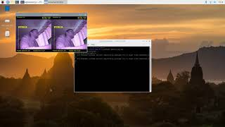

# Firefighter Helmet

This solution was created by Sergejs Levsovs as univercity project and for Call for Code 2020

## Author

Sergejs Levsovs - Cognizant

## Content

1. [Overview](#overview)
2. [Video](#video)
3. [The idea](#the-idea)
4. [How it works](#how-it-works)
5. [Getting started](#getting-started)
6. [License](#license)

## Overview

### What's the problem?

Fire fighters have to work in extremely dangerous, high stress situations. Amount of information they have to process themselves puts extreme load on their brain. 
Sensory limitations of a human only make firefighters job even harder as soot particles in smoke effectively block visible light.

### How technology can help?

Technology implemented in firefighters uniform can assist during their work and make it safer. Specific use cases include object detection support in case of search 
and rescue operations, navigation through low light areas and high dense smoke, prolonged air supply by switching between air filter and air supply, SOS signaling 
in case of firefighter unconsciousness.

## Video

Testing object detection on split screen.

## The idea

This prototype aims to reduce injury and mortality rate of firefighters by introducing AI and IoT technology to their uniform.

## How it works

### As is.

Raspbery Pi, PiCamera, 7inch screen and Coral USB accelerator were attached to VR headset.

PiCamera captures video, so firefigters head can be fully covered for protection from fire, smoke, debris. Each frame is analyzed by edgetpu object detection model. 
In case if object was detected model returns coordinates of the object in the frame. OpenCV module uses coordinates to draw a rectangle around the object and a label 
of the object eg. “person”. Same time OpenCV is used to split screen, to accommodate vision to both eyes. Watson IoT is used to send live data to cloud, 
such as frames per second and amount of frames with positive detection, for visualization.

### Diagram

### Long Run.

In the future development of full uniform will be required.

Additional sensors to get information of vital signs, air quality, accelerometer to detect movement. Acquired information will be sent to cloud via IoT for analysis 
and potential action, such as signal firefighter to get clear of smoke in case if blood oxygen level drops low.

Virtual wearable interface to allow firefighter to interact with device.

## Getting started

Use the following steps to get As Is solution up and running.

### Hardware

1. [Trust VR]( https://www.trust.com/en/virtualreality) headset
2. [Raspberry Pi 4 model B](https://www.raspberrypi.org/products/raspberry-pi-4-model-b/) with 4GM RAM
3. IR PiCamera
4. Google Coral [USB Accelerator](https://coral.ai/products/accelerator/)
5. 7inch HDMI Display-C

Some changes to VR headset and manufacturing of the mount will be required to fit display to the hedset.
Lots of hotglue will be required as well.

### Software Prerequisite

1. [Raspbian Buster](https://www.raspberrypi.org/downloads/raspberry-pi-os/) needs to be installed on Raspberry Pi
2. [Python 3](https://www.python.org/download/releases/3.0/) should come with Raspbian
3. For [OpenCV](https://opencv.org/) use 'sudo apt-get install libopencv-dev python3-opencv' without quotes
4. To use USB Accelerator for object detection follow instalation guide [here](https://coral.withgoogle.com/docs/accelerator/get-started/)

### Steps

1. Install all prerequisites
2. Clone repository anywhere
3. Create bash script on desktop to launch solution by calling 'python3 Path_to_Repository\detect_obj.py' without quotes

## License

This solution starter is made available under the [Apache 2 License](LICENSE).

